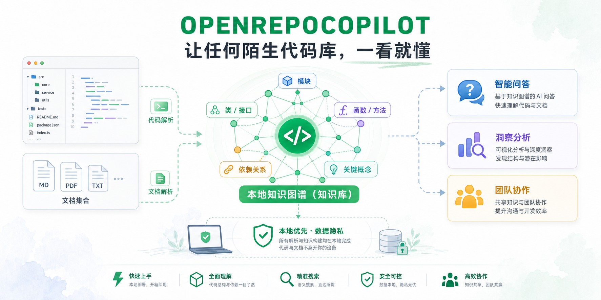

<h1 align="center">OpenRepoCopilot</h1>

<p align="center">
  <strong>让任何陌生代码库，一看就懂。</strong>
  <br />
  <em>本地优先的代码仓库理解、知识图谱与 AI 分析工作台。</em>
</p>

<p align="center">
  <a href="#-快速开始"></a>
  <a href="#-两种使用方式"></a>
  <a href="#skill-版本"></a>
  <a href="LICENSE"></a>
  <a href="https://github.com/Knight5128/OpenRepoCopilot"></a>
</p>

<p align="center">
  
</p>

---

**刚接手一个陌生仓库，不知道该从哪里开始？**

OpenRepoCopilot 将公开 GitHub 仓库或文档知识库转换为可探索的知识图谱。它会在本地管理项目、分析任务和图谱文件，并通过 Dashboard 展示代码结构、模块关系、函数、类、依赖与关键概念。

> 目标不是生成一张看起来复杂的图，而是帮助你快速理解每个部分如何协同工作。

## ✨ 核心能力

<table>
  <tr>
    <td width="50%" valign="top">
      <h3>🗂️ 多项目工作台</h3>
      <p>统一管理多个 GitHub 仓库和文档知识库，查看分析状态、任务队列与本地图谱。</p>
    </td>
    <td width="50%" valign="top">
      <h3>🕸️ 交互式知识图谱</h3>
      <p>将文件、模块、类、函数、接口和依赖关系转化为可搜索、可点击的结构图。</p>
    </td>
  </tr>
  <tr>
    <td width="50%" valign="top">
      <h3>🤖 AI 语义分析</h3>
      <p>结合静态分析与 OpenAI-compatible Agent API，补充代码摘要、概念和架构语义。</p>
    </td>
    <td width="50%" valign="top">
      <h3>🔒 本地优先</h3>
      <p>项目、任务、导入文档和生成图谱默认保存在本机；API Key 不写入项目设置文件。</p>
    </td>
  </tr>
  <tr>
    <td width="50%" valign="top">
      <h3>📚 仓库与文档分析</h3>
      <p>支持公开 GitHub 仓库，以及 <code>.md</code>、<code>.txt</code>、<code>.pdf</code>、<code>.docx</code> 文档集合。</p>
    </td>
    <td width="50%" valign="top">
      <h3>🎨 亮色、暗色与系统主题</h3>
      <p>Dashboard 支持亮色、暗色和跟随操作系统三种外观模式。</p>
    </td>
  </tr>
</table>

## 🧭 工作流程

```text
GitHub 仓库 / 文档集合
          │
          ▼
   创建本地项目
          │
          ▼
  扫描与结构化解析
          │
          ▼
 AI 摘要与语义补充
          │
          ▼
  生成知识图谱 JSON
          │
          ▼
 Dashboard 搜索与探索
```

典型使用步骤：

1. 创建一个 GitHub 仓库项目或文档知识库。
2. 点击 `Begin Analysis` 创建分析任务。
3. 后台 Worker 扫描代码、解析结构并调用配置的 Agent API。
4. 在项目页查看进度，完成后点击 `Open Graph`。
5. 在图谱中搜索节点、查看关系并理解仓库结构。

## 🚀 快速开始

### Windows

在 PowerShell 中运行：

```powershell
iwr -useb https://raw.githubusercontent.com/Knight5128/OpenRepoCopilot/main/install.ps1 | iex
```

安装器会询问使用的平台，随后下载项目、构建本地工作台并链接对应 Skills。

直接指定 Codex：

```powershell
& ([scriptblock]::Create((iwr -useb https://raw.githubusercontent.com/Knight5128/OpenRepoCopilot/main/install.ps1))) codex
```

### macOS / Linux

```bash
curl -fsSL https://raw.githubusercontent.com/Knight5128/OpenRepoCopilot/main/install.sh | bash
```

直接指定 Codex：

```bash
curl -fsSL https://raw.githubusercontent.com/Knight5128/OpenRepoCopilot/main/install.sh | bash -s codex
```

安装完成后，重启对应的 CLI 或 IDE，使 Skills 生效。

## 📦 两种使用方式

### App 版本

适合希望直接使用完整本地工作台的用户，包含：

- OpenRepoCopilot CLI 与本地 API Server
- React Dashboard
- 核心图谱与语言解析逻辑
- Windows、macOS、Linux 安装脚本
- Agent Skills 和分析 Worker

从源码启动：

```powershell
corepack pnpm install --frozen-lockfile
corepack pnpm --filter @understand-anything/core build
corepack pnpm --filter @openrepo-copilot/server build
corepack pnpm --filter @understand-anything/dashboard build
New-Item -ItemType Directory -Force .openrepo-dev
$env:OPENREPO_HOME = (Resolve-Path .openrepo-dev).Path
$env:VITE_OPENREPO_MODE = "true"
corepack pnpm dev:dashboard -- --host 127.0.0.1
```

浏览器访问：

```text
http://127.0.0.1:5173/
```

正式压缩包将在 GitHub Releases 中提供。仓库维护者可通过以下命令生成：

```powershell
corepack pnpm package:app
```

输出位置：

```text
release/openrepo-copilot-app-<timestamp>/
release/openrepo-copilot-app-<timestamp>.zip
```

### Skill 版本

适合希望从 Codex、Gemini CLI、OpenCode、VS Code Copilot 等 Agent 环境直接调用 OpenRepoCopilot 的用户。

主要命令：

```text
/openrepo
/openrepo-analyze <project-id>
```

- `/openrepo`：启动本地工作台。
- `/openrepo-analyze <project-id>`：处理指定项目的下一项排队分析任务。

底层图谱能力同时保留兼容命令：

```text
/understand
/understand-dashboard
/understand-chat
/understand-diff
/understand-explain
/understand-onboard
/understand-domain
/understand-knowledge
```

当前 Skill 版本通过仓库安装脚本分发。npm 一键导入包将在正式发布后补充准确命令，发布前不会提供无效包名。

## 🧩 支持的平台

| 平台 | 状态 | Skills 目录 |
| --- | --- | --- |
| Codex | ✅ 支持 | `~/.agents/skills` |
| Gemini CLI | ✅ 支持 | `~/.agents/skills` |
| OpenCode | ✅ 支持 | `~/.agents/skills` |
| Pi Agent | ✅ 支持 | `~/.agents/skills` |
| VS Code Copilot | ✅ 支持 | `~/.copilot/skills` |
| OpenClaw | ✅ 支持 | `~/.openclaw/skills` |
| Antigravity | ✅ 支持 | `~/.gemini/antigravity/skills` |
| Hermes | ✅ 支持 | `~/.hermes/skills` |
| Cline | ✅ 支持 | `~/.cline/skills` |
| KIMI CLI | ✅ 支持 | `~/.kimi/skills` |
| Trae | ✅ 支持 | `~/.trae/skills` |

更新已有安装：

```powershell
./install.ps1 -Update
```

```bash
./install.sh --update
```

卸载指定平台的 Skills：

```powershell
./install.ps1 -Uninstall codex
```

```bash
./install.sh --uninstall codex
```

## ⚙️ Agent API 配置

OpenRepoCopilot 默认使用阿里云百炼 / DashScope 的 OpenAI-compatible 接口：

| 配置 | 默认值 |
| --- | --- |
| Provider | DashScope / Alibaba Bailian |
| Base URL | `https://dashscope.aliyuncs.com/compatible-mode/v1` |
| Model | `glm-5.1` |
| API Key 环境变量 | `DASHSCOPE_API_KEY` |

Dashboard 还提供 ZhipuAI、OpenAI、DeepSeek、OpenRouter 和自定义 OpenAI-compatible 服务预设。

API Key 应通过环境变量或本地文件提供：

```text
<OPENREPO_HOME>/agent.env
```

示例：

```env
DASHSCOPE_API_KEY=your-dashscope-api-key
ZHIPUAI_API_KEY=your-zhipuai-api-key
OPENAI_API_KEY=your-openai-api-key
DEEPSEEK_API_KEY=your-deepseek-api-key
OPENROUTER_API_KEY=your-openrouter-api-key
OPENREPO_AGENT_API_KEY=your-custom-provider-api-key
```

不要提交 `.env`、`agent.env`、Token 或其他凭据。

## 💾 本地数据

默认数据目录：

```text
~/.openrepo-copilot
```

可通过 `OPENREPO_HOME` 修改：

```powershell
$env:OPENREPO_HOME = "D:\OpenRepoCopilot\data"
```

项目数据包括：

```text
projects/
  <project-id>/
    project.json
    jobs/
    source/
    .understand-anything/
```

生成图谱继续使用兼容目录：

```text
.understand-anything/
```

可共享知识图谱文件，但不要提交本地临时文件：

```gitignore
.understand-anything/intermediate/
.understand-anything/tmp/
.understand-anything/diff-overlay.json
```

## 🏗️ 技术架构

OpenRepoCopilot 采用静态分析与大语言模型结合的方式：

- **Tree-sitter / 结构解析**：提取文件、导入、导出、函数、类、接口、调用与继承关系。
- **Agent 语义分析**：生成代码摘要、标签、架构层与关键概念。
- **Knowledge Graph**：将结构事实与语义信息合并为统一 JSON 图谱。
- **Local Server**：管理项目、设置、任务队列、日志和图谱文件。
- **React Dashboard**：提供项目工作台、状态展示和交互式图谱。

<p align="center">
  
</p>

## 📁 仓库结构

```text
.
├── understand-anything-plugin/
│   ├── packages/
│   │   ├── core/          # 图谱 Schema、解析与核心逻辑
│   │   ├── openrepo/      # OpenRepoCopilot CLI、Server、Store、Worker
│   │   └── dashboard/     # React 工作台与知识图谱界面
│   ├── skills/            # Agent Skills
│   └── agents/            # 图谱分析 Agent
├── homepage/              # 项目官网
├── scripts/               # 打包和辅助脚本
├── tests/                 # Skill 与集成测试
├── install.ps1            # Windows 安装入口
└── install.sh             # macOS / Linux 安装入口
```

部分内部包名仍使用历史 `understand-anything` 命名空间，这是图谱兼容性和构建路径的一部分；面向用户的产品名称统一为 OpenRepoCopilot。

## 🧪 开发与验证

安装依赖：

```powershell
corepack pnpm install --frozen-lockfile
```

常用命令：

```powershell
corepack pnpm build
corepack pnpm test
corepack pnpm lint
corepack pnpm dev:dashboard
corepack pnpm package:app
```

按模块执行快速检查：

```powershell
corepack pnpm --filter @understand-anything/core build
corepack pnpm --filter @openrepo-copilot/server test
corepack pnpm --filter @openrepo-copilot/server build
corepack pnpm --filter @understand-anything/dashboard build
```

Dashboard 和本地 API 应绑定：

```text
127.0.0.1
```

## 🙏 项目来源

OpenRepoCopilot 基于 [Egonex-AI/Understand-Anything](https://github.com/Egonex-AI/Understand-Anything) 的知识图谱、Dashboard 与 Agent Skills 能力继续开发，增加了面向多项目管理的本地工作台、任务队列、内置分析 Worker、安装脚本和应用打包流程。

感谢 Understand Anything 及其贡献者提供的开源基础。

## 🤝 贡献

1. Fork 仓库。
2. 从 `main` 创建功能分支。
3. 完成修改并运行相关测试。
4. 执行 `git diff --check`。
5. 提交 Pull Request。

建议提交信息：

```text
Add OpenRepoCopilot app packaging workflow
Fix installer repository defaults
Improve dashboard project navigation
```

## 📄 License

[MIT](LICENSE)

<p align="center">
  <strong>Stop reading code blind. Start understanding the repository.</strong>
</p>
